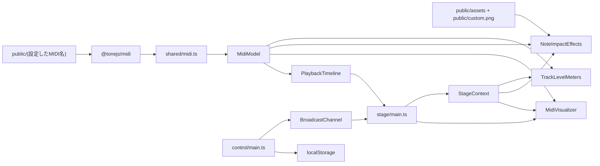
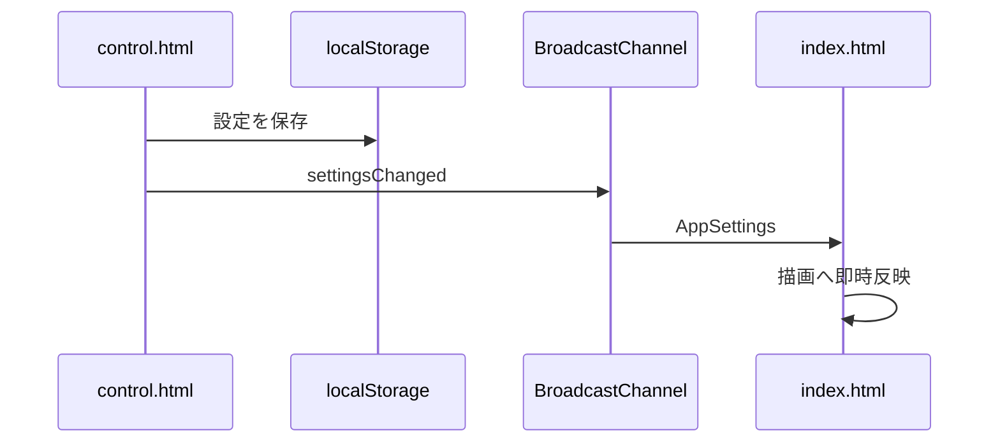

# アーキテクチャ

## 技術構成

- Vite
- TypeScript
- Three.js
- `@tonejs/midi`
- HTML / CSS
- Docker Compose
- Node.js 24コンテナ

状態管理フレームワーク、UIフレームワーク、ルーターは使用しません。

## マルチページ構成

| エントリー | 用途 |
|---|---|
| `index.html` | 映像ページ |
| `control.html` | 設定ページ |

ViteのRollup Inputへ2つのHTMLを指定します。

## ディレクトリ

```text
.
├─ index.html
├─ control.html
├─ public/
│	├─ assets/
│	│	├─ flare.png
│	│	├─ ring.png
│	│	└─ spark.png
│	├─ custom.png
│	└─ input.mid
├─ src/
│	├─ control/
│	│	└─ main.ts
│	├─ shared/
│	│	├─ channel.ts
│	│	├─ midi.ts
│	│	├─ public-files.ts
│	│	├─ settings.ts
│	│	└─ types.ts
│	├─ stage/
│	│	├─ distance-visibility.ts
│	│	├─ effect-tuning/
│	│	│	├─ long-note.ts
│	│	│	├─ math.ts
│	│	│	├─ note-on.ts
│	│	│	└─ note.ts
│	│	├─ effects.ts
│	│	├─ level-meters.ts
│	│	├─ long-note-dissolve.ts
│	│	├─ main.ts
│	│	├─ palette.ts
│	│	├─ stage-context.ts
│	│	├─ timeline.ts
│	│	└─ visualizer.ts
│	└─ styles/
│		├─ control.css
│		└─ stage.css
└─ docs/
```

## モジュール責務

### `shared/types.ts`

- `AppSettings`
- `VisualNote`
- `MidiModel`
- Timeline MarkerとTempo Marker
- ページ間メッセージUnion

共有されるデータ契約を定義します。

### `shared/midi.ts`

- 設定されたMIDIファイルの取得
- `@tonejs/midi`による解析
- ノートTrackの抽出
- Noteデータの正規化
- Pitch範囲と曲長の算出
- 小節、拍、Tempo Timelineの生成

Three.jsへ依存しません。

### `shared/public-files.ts`

- 入力値からDirectory部分を除外
- 省略された`.mid`または`.png`の補完
- `public`直下のURL生成

### `shared/settings.ts`

- 初期設定
- `localStorage`読み込み
- 保存済み値と初期値のマージ
- 保存

### `shared/channel.ts`

- `BroadcastChannel`生成
- 型付きメッセージ送信
- メッセージ購読
- Close処理

### `stage/timeline.ts`

- プリロール先頭からの再生開始
- 停止
- `performance.now()`基準の現在時刻
- ポストロール終端での停止
- 設定変更による再構成

描画やDOMへ依存しません。

### `stage/stage-context.ts`

- Stage画面で共有する最新`AppSettings`の保持
- 読み取り専用設定Accessor
- 設定変更前後のSnapshot通知
- 購読解除関数によるLifecycle管理

グローバルSingletonにはせず、`stage/main.ts`が生成した1つのInstanceをStage内の各描画クラスへ注入します。各エフェクト固有のRequest生成や描画状態は保持しません。

### `stage/visualizer.ts`

- Renderer、Scene、Camera
- Note MeshとGlow
- 小節枠、拍枠、発音平面
- 背景、Fog、Light
- 設定変更時の再構築
- 球面オービットカメラ
- ウィンドウリサイズ
- Three.js ResourceのDispose

### `stage/distance-visibility.ts`

- ノートとレベルメータで共有するFog軽減Shader処理
- Fog適用前後の色を`distanceVisibility`で補間
- Material種別ごとのShader Program Cache Key

### `stage/effect-tuning/note.ts`

- 通常ノート、発音中、Note Off残光の表示計算
- Emissive、ノートOpacity、Glow Opacity

### `stage/effect-tuning/long-note.ts`

- ロングトーン粒子の個数、速度、配置、拡散、減衰
- ロングトーンFade中のノート表示
- 粒子化範囲、配置密度、粒子化前発光
- Active粒子数と1ノート粒子数の安全上限

### `stage/effect-tuning/note-on.ts`

- Note Onエフェクト4種のDuration、Opacity、Scale、Velocity係数
- スパークの個数、速度、移動Curve
- カスタム画像の最低ScaleとFade Curve

### `stage/effect-tuning/math.ts`

- Opacity、Blend率、Progressの`0〜1`制限
- DurationとSizeの下限保証
- `NaN`と`Infinity`のFallback
- LerpとEasing

各カテゴリーは直接Importし、バレルモジュールを使用しません。曲ごとに変更する値ではなく、演出自体を開発時に調整する値を各ファイルの先頭へまとめます。設定画面と`localStorage`の対象にはしません。

### `stage/effects.ts`

- 組み込みTextureとカスタムTextureの非同期読み込み
- Note On時のコアフラッシュ、リング、スパーク、カスタム画像生成
- `effect-tuning/note-on.ts`の計算結果をThree.js Objectへ適用
- Active EffectとTextureのDispose
- 専用`NoteImpactTriggerRequest`による発音入力

### `stage/long-note-dissolve.ts`

- `spark.png`の非同期読み込み
- ロングトーン粒子Burstの生成
- `effect-tuning/long-note.ts`の計算結果を`THREE.Points`へ適用
- Active粒子数の上限制御
- Three.js ResourceのDispose
- 専用`LongNoteDissolveTriggerRequest`による粒子化入力

### `stage/level-meters.ts`

- TrackごとのVelocity Envelope
- 20セグメントの点灯状態
- Holdと一定時間Decay
- 低・中・高の3つの`InstancedMesh`
- 感度に応じたZone境界の線形補間
- 色、Opacity、高さ、幅の即時更新
- 共通Fog軽減Shader Uniformの更新
- 専用`LevelMeterTriggerRequest`によるNote On入力

### `stage/palette.ts`

- ノート、発音エフェクト、Trackカラーメータで共有する色配列

### `stage/main.ts`

- DOM取得
- MIDI読み込みの制御
- TimelineとVisualizerの接続
- `requestAnimationFrame`
- BPMと拍数表示
- キーボード入力
- ページ間メッセージ処理
- エラー表示

### `control/main.ts`

- 設定定義からUIを生成
- 入力値を`AppSettings`へ反映
- 保存と通知
- MIDI再読み込み要求
- 成功・失敗alert

## データフロー



## 描画更新

毎フレームの処理順は次のとおりです。

1. 前フレームとの差から`deltaSeconds`を算出する。
2. 押下中のカメラ操作キーから水平、垂直、ズーム方向を求める。
3. カメラの角度と距離を更新する。
4. Timelineを現在の`performance.now()`で更新する。
5. ノートGroupと枠GroupのZ位置を更新する。
6. 発音中と残光中のMaterialを更新する。
7. 前フレームから通過したNote Onを検出し、発音エフェクトとTrackレベルメータを更新する。
8. SceneをRenderする。
9. BPMと拍数表示を更新する。

## 時間と空間の分離

ノートや枠は、イベントの絶対秒をもとに初期Z位置を持ちます。毎フレーム全オブジェクトの個別位置を計算せず、Groupへ次のOffsetを与えます。

```text
group.position.z = currentSongSeconds × timeUnitsPerSecond
```

これにより、イベントが発音平面Z=`0`へ近づきます。

## 設定同期



## Resource管理

- 設定変更で再構築するGroupは、既存GeometryとMaterialをDisposeする。
- 背景Textureを更新するときは旧TextureをDisposeする。
- 発音エフェクト終了時は個別MaterialをDisposeし、共有GeometryとTextureは管理クラス終了時にDisposeする。
- Trackレベルメータは共有Geometryと3つのInstancedMeshを終了時にDisposeする。
- ページ終了時にScene ResourceとRendererをDisposeする。
