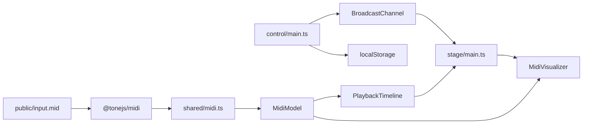
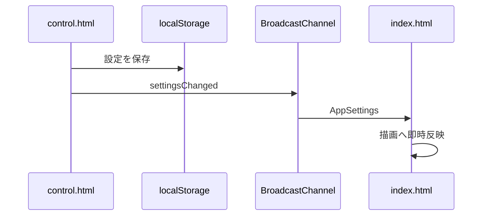

# アーキテクチャ

## 技術構成

- Vite
- TypeScript
- Three.js
- `@tonejs/midi`
- HTML / CSS
- Docker Compose
- Node.js 24コンテナ

状態管理フレームワーク、UIフレームワーク、ルーターは使用しません。

## マルチページ構成

| エントリー | 用途 |
|---|---|
| `index.html` | 映像ページ |
| `control.html` | 設定ページ |

ViteのRollup Inputへ2つのHTMLを指定します。

## ディレクトリ

```text
.
├─ index.html
├─ control.html
├─ public/
│	└─ input.mid
├─ src/
│	├─ control/
│	│	└─ main.ts
│	├─ shared/
│	│	├─ channel.ts
│	│	├─ midi.ts
│	│	├─ settings.ts
│	│	└─ types.ts
│	├─ stage/
│	│	├─ main.ts
│	│	├─ timeline.ts
│	│	└─ visualizer.ts
│	└─ styles/
│		├─ control.css
│		└─ stage.css
└─ docs/
```

## モジュール責務

### `shared/types.ts`

- `AppSettings`
- `VisualNote`
- `MidiModel`
- Timeline MarkerとTempo Marker
- ページ間メッセージUnion

共有されるデータ契約を定義します。

### `shared/midi.ts`

- `input.mid`の取得
- `@tonejs/midi`による解析
- ノートTrackの抽出
- Noteデータの正規化
- Pitch範囲と曲長の算出
- 小節、拍、Tempo Timelineの生成

Three.jsへ依存しません。

### `shared/settings.ts`

- 初期設定
- `localStorage`読み込み
- 保存済み値と初期値のマージ
- 保存

### `shared/channel.ts`

- `BroadcastChannel`生成
- 型付きメッセージ送信
- メッセージ購読
- Close処理

### `stage/timeline.ts`

- プリロール先頭からの再生開始
- 停止
- `performance.now()`基準の現在時刻
- ポストロール終端での停止
- 設定変更による再構成

描画やDOMへ依存しません。

### `stage/visualizer.ts`

- Renderer、Scene、Camera
- Note MeshとGlow
- 小節枠、拍枠、発音平面
- 背景、Fog、粒子、Light
- 設定変更時の再構築
- 球面オービットカメラ
- ウィンドウリサイズ
- Three.js ResourceのDispose

### `stage/main.ts`

- DOM取得
- MIDI読み込みの制御
- TimelineとVisualizerの接続
- `requestAnimationFrame`
- BPMと拍数表示
- キーボード入力
- ページ間メッセージ処理
- エラー表示

### `control/main.ts`

- 設定定義からUIを生成
- 入力値を`AppSettings`へ反映
- 保存と通知
- MIDI再読み込み要求
- 成功・失敗alert

## データフロー



## 描画更新

毎フレームの処理順は次のとおりです。

1. 前フレームとの差から`deltaSeconds`を算出する。
2. 押下中のカメラ操作キーから水平、垂直、ズーム方向を求める。
3. カメラの角度と距離を更新する。
4. Timelineを現在の`performance.now()`で更新する。
5. ノートGroupと枠GroupのZ位置を更新する。
6. 発音中と残光中のMaterialを更新する。
7. SceneをRenderする。
8. BPMと拍数表示を更新する。

## 時間と空間の分離

ノートや枠は、イベントの絶対秒をもとに初期Z位置を持ちます。毎フレーム全オブジェクトの個別位置を計算せず、Groupへ次のOffsetを与えます。

```text
group.position.z = currentSongSeconds × timeUnitsPerSecond
```

これにより、イベントが発音平面Z=`0`へ近づきます。

## 設定同期



## Resource管理

- 設定変更で再構築するGroupは、既存GeometryとMaterialをDisposeする。
- 背景Textureを更新するときは旧TextureをDisposeする。
- ページ終了時にScene ResourceとRendererをDisposeする。
