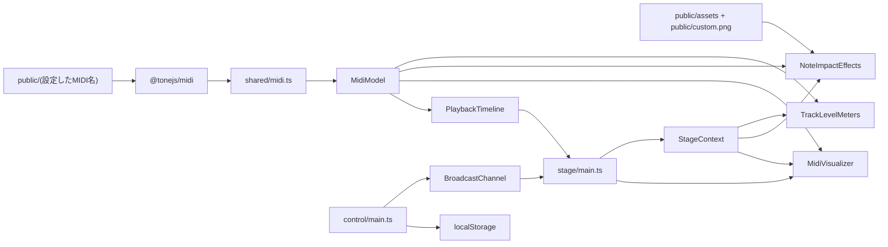
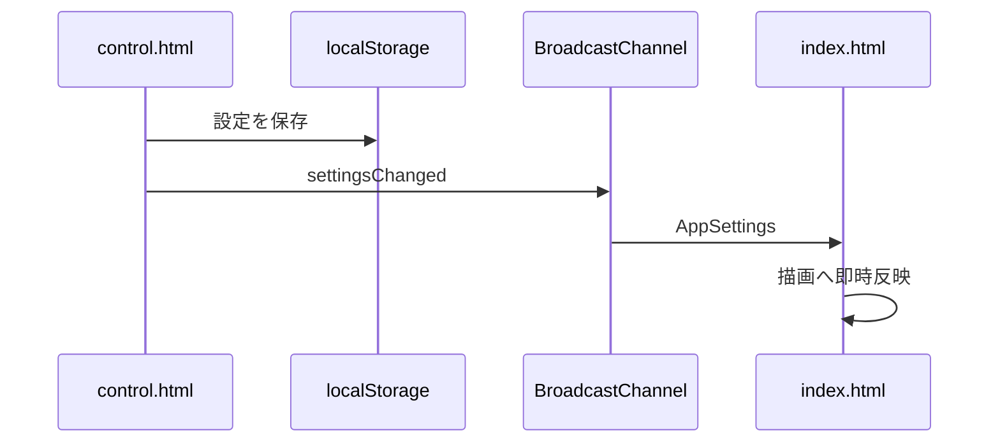

# アーキテクチャ

## 技術構成

- Vite
- TypeScript
- Three.js
- `@tonejs/midi`
- HTML / CSS
- Docker Compose
- Node.js 24コンテナ

状態管理フレームワーク、UIフレームワーク、ルーターは使用しません。

## マルチページ構成

| エントリー | 用途 |
|---|---|
| `index.html` | 映像ページ |
| `control.html` | 設定ページ |

ViteのRollup Inputへ2つのHTMLを指定します。

## ディレクトリ

```text
.
├─ index.html
├─ control.html
├─ public/
│	├─ assets/
│	│	├─ beat.svg
│	│	├─ flare.png
│	│	├─ metronome.svg
│	│	├─ ring.png
│	│	└─ spark.png
│	├─ custom.png
│	└─ input.mid
├─ src/
│	├─ control/
│	│	└─ main.ts
│	├─ shared/
│	│	├─ channel.ts
│	│	├─ midi.ts
│	│	├─ public-files.ts
│	│	├─ settings.ts
│	│	├─ track-order.ts
│	│	├─ tracks.ts
│	│	└─ types.ts
│	├─ stage/
│	│	├─ core/
│	│	│	├─ distance-visibility.ts
│	│	│	├─ midi-time-map.ts
│	│	│	├─ palette.ts
│	│	│	└─ stage-layout.ts
│	│	├─ effects/
│	│	│	├─ level-meters.ts
│	│	│	├─ long-note-dissolve.ts
│	│	│	├─ note-impact-effects.ts
│	│	│	├─ note-impact/
│	│	│	│	├─ active-*.ts
│	│	│	│	├─ core-flash.ts
│	│	│	│	├─ custom-image.ts
│	│	│	│	├─ impact-ring.ts
│	│	│	│	├─ materials.ts
│	│	│	│	├─ sparks.ts
│	│	│	│	├─ texture.ts
│	│	│	│	└─ types.ts
│	│	│	└─ tuning/
│	│	│		├─ long-note.ts
│	│	│		├─ math.ts
│	│	│		├─ note-on.ts
│	│	│		└─ note.ts
│	│	├─ main.ts
│	│	├─ notes/
│	│	│	├─ note-layer.ts
│	│	│	├─ note-on-reaction-controller.ts
│	│	│	└─ rendered-note.ts
│	│	├─ scene/
│	│	│	├─ guide-frame.ts
│	│	│	├─ orbit-camera-controller.ts
│	│	│	├─ stage-environment.ts
│	│	│	└─ timeline-guide-layer.ts
│	│	├─ stage-context.ts
│	│	├─ timeline.ts
│	│	└─ visualizer.ts
│	└─ styles/
│		├─ control.css
│		└─ stage.css
└─ docs/
```

Stage内の依存方向は次のとおりです。`main.ts`が直接参照するRoot 3ファイルのPathは維持し、下位カテゴリーから`main.ts`へ逆向きに依存しません。

```text
main.ts
├─ stage-context.ts
├─ timeline.ts
└─ visualizer.ts
	├─ core/
	├─ scene/ ──→ core/
	├─ notes/ ──→ core/ + effects/
	└─ effects/ ──→ core/ + tuning/ + note-impact/
```

## モジュール責務

### `shared/types.ts`

- `AppSettings`
- `VisualNote`
- `MidiModel`
- Timeline MarkerとTempo Marker
- ページ間メッセージUnion

共有されるデータ契約を定義します。

### `shared/midi.ts`

- 設定されたMIDIファイルの取得
- `@tonejs/midi`による解析
- ノートTrackの抽出
- NoteとTrackデータの正規化
- Trackごとの最大ノート長と平均Pitchの算出
- Pitch範囲と曲長の算出
- 小節、拍、Tempo Timelineの生成

Three.jsへ依存しません。

### `shared/tracks.ts`

- `VisualTrack`によるTrack ID、元SMF Index、名前、ノート、派生値の保持
- `TrackCollection`によるTrack ID検索と現在の表示順管理
- `applyOrder()`による並び順計算と適用の一元管理
- 算出されたTrack IDが全Trackを過不足なく含むことの検証
- Track IDから表示Indexへの変換

Track IDはTrackの同一性、表示Indexは現在の配置を表します。両者を分離し、並べ替え後もノートやLevel Meterの状態はTrack IDへ紐付けたまま、X座標とTrack色だけを表示Indexから求めます。

### `shared/track-order.ts`

- MIDIトラック、音長、音程、スマートのComparator選択
- 8拍超と8拍以下を分けるスマート順の生成
- 最終順序の反転
- 並び順を表すTrack ID配列の算出

`TrackOrderer`は順序計算だけを担当する`TrackCollection`の内部協力Objectであり、Collectionを変更しません。`TrackCollection`が`TrackOrderer.resolve()`の結果を検証して自分自身へ適用し、Track管理の公開責務を維持します。どちらもThree.jsへ依存しません。

### `shared/public-files.ts`

- 入力値からDirectory部分を除外
- 省略された`.mid`または`.png`の補完
- `public`直下のURL生成

### `shared/settings.ts`

- 初期設定
- `localStorage`読み込み
- 保存済み値と初期値のマージ
- 保存

### `shared/channel.ts`

- `BroadcastChannel`生成
- 型付きメッセージ送信
- メッセージ購読
- Close処理

### `stage/timeline.ts`

- プリロール先頭からの再生開始
- 停止
- `performance.now()`基準の現在時刻
- ポストロール終端での停止
- 設定変更による再構成

描画やDOMへ依存しません。

### `stage/stage-context.ts`

- Stage画面で共有する最新`AppSettings`の保持
- 読み取り専用設定Accessor
- 設定変更前後のSnapshot通知
- 購読解除関数によるLifecycle管理
- 設定値を使用した演出用Velocity変換

グローバルSingletonにはせず、`stage/main.ts`が生成した1つのInstanceをStage内の各描画クラスへ注入します。各エフェクト固有のRequest生成や描画状態は保持しません。

### `stage/visualizer.ts`

- RendererとScene
- Stage描画オブジェクトの生成とSceneへの接続
- MIDI Loadと設定変更の各オブジェクトへの委譲
- Note、Guide、Reactionの更新順序
- ウィンドウリサイズ
- 各オブジェクトのDispose呼び出し

具体的な表示処理は持たず、Composition Root兼Orchestratorとして機能します。

### `stage/core/stage-layout.ts`

- Track数、Pitch範囲、設定からWorld寸法と中心座標を算出
- Track IDから現在の表示IndexとX座標への変換
- 現在の表示Indexに対するTrack色の割り当て
- MIDI PitchからY座標への変換

### `stage/core/midi-time-map.ts`

- Tempo MarkerとPPQの保持
- 秒からTick、Tickから秒への二分探索による相互変換
- Three.js非依存の時間Domain Service

### `stage/scene/stage-environment.ts`

- 背景Gradient Texture、Fog、Ambient Light、Key Lightの所有
- 背景設定変更時のTexture差し替え
- TextureとScene ResourceのLifecycle管理

### `stage/scene/guide-frame.ts` / `timeline-guide-layer.ts`

- 小節枠、拍枠、発音平面を表す具象`GuideFrame`クラス
- Timeline上を移動する枠と固定発音平面のGroup管理
- 設定変更時の再構築
- GeometryとMaterialのDispose

### `stage/notes/rendered-note.ts`

- 1ノート分のMesh、Glow、Material、Uniformの所有
- 通常、発音中、残光、ロングトーンFadeの表示状態更新
- ロングトーン粒子化判定と粒子位置生成
- 1ノート分のThree.js ResourceのDispose

### `stage/notes/note-layer.ts`

- `RenderedNote` Collectionと移動Groupの管理
- 全ノートのFrame更新
- 再生巻き戻りと設定変更による粒子化状態Reset
- `LongNoteDissolveEffects`の所有と更新

### `stage/notes/note-on-reaction-controller.ts`

- Note On走査位置と前回再生時刻の保持
- Note On通過時の発音エフェクトとレベルメータのTrigger
- 巻き戻り時のCursor、エフェクト、メータReset
- `NoteImpactEffects`と`TrackLevelMeters`の所有

### `stage/scene/orbit-camera-controller.ts`

- Perspective Cameraと球面Orbit状態の所有
- World寸法に合わせた初期位置とClip範囲の計算
- キーボード操作、Reset、Resize、Projection更新

### `stage/core/distance-visibility.ts`

- ノートとレベルメータで共有するFog軽減Shader処理
- Fog適用前後の色を`distanceVisibility`で補間
- Material種別ごとのShader Program Cache Key

### `stage/effects/tuning/note.ts`

- 通常ノート、発音中、Note Off残光の表示計算
- Emissive、ノートOpacity、Glow Opacity

### `stage/effects/tuning/long-note.ts`

- ロングトーン粒子の個数、速度、配置、拡散、減衰
- ロングトーンFade中のノート表示
- 粒子化範囲、配置密度、粒子化前発光
- Active粒子数と1ノート粒子数の安全上限

### `stage/effects/tuning/note-on.ts`

- Note Onエフェクト4種のDuration、Opacity、Scale、Velocity係数
- リング、スパーク、カスタム画像で演出用Velocityの`0〜2`を許可
- 即時と遅延リングのAppearance Sequence計算
- スパークの個数、速度、移動Curve
- カスタム画像の最低ScaleとFade Curve

### `stage/effects/tuning/math.ts`

- Opacity、Blend率、Progressの`0〜1`制限
- DurationとSizeの下限保証
- `NaN`と`Infinity`のFallback
- LerpとEasing

各カテゴリーは直接Importし、バレルモジュールを使用しません。曲ごとに変更する値ではなく、演出自体を開発時に調整する値を各ファイルの先頭へまとめます。設定画面と`localStorage`の対象にはしません。

### `stage/effects/note-impact-effects.ts`

- Note Onエフェクト4種を接続するFacade
- Note Onごとに演出用Velocityを1度だけ取得し、リング、スパーク、カスタム画像へ適用
- 設定ON/OFFによるTrigger振り分けとActive Effect破棄
- Active Effect Queueの更新、Clear、Dispose
- 専用`NoteImpactTriggerRequest`による発音入力

### `stage/effects/note-impact/active-effect.ts`

- 生成済みNote Onエフェクトの抽象基底クラス
- 経過時間、遅延、表示開始、完了判定の共通Lifecycle
- Scale、Opacityの共通Frame適用
- 発生位置とMaterial Disposeの所有

### `stage/effects/note-impact/active-*.ts`

- コアフラッシュ、拡散リング、スパーク、カスタム画像の具象Active Effect
- スパーク固有の移動状態とFrame更新
- カスタム画像固有のFade Curve選択
- 継承だけの具象クラスによるDomain上の種類の明示

### `stage/effects/note-impact/active-effect-queue.ts`

- 生成済みActive Effectの追加と反復更新
- 種類別、位置別、全体のClear
- Active Effect数の上限制御
- Three.js Groupへの追加・除去とActive EffectのDispose呼び出し

### `stage/effects/note-impact/core-flash.ts`

- `flare.png`の非同期読み込み
- コアフラッシュSpriteの生成
- 生VelocityによるAppearance計算結果の適用

### `stage/effects/note-impact/impact-ring.ts`

- `ring.png`の非同期読み込み
- 即時リングと遅延リングのPlane生成
- 2枚目リングへのDelayと拡大終了サイズの適用

### `stage/effects/note-impact/sparks.ts`

- `spark.png`の非同期読み込み
- Velocityに応じた個数のSpark Sprite生成
- 個別の移動速度を持つ`ActiveSparkEffect`の生成

### `stage/effects/note-impact/custom-image.ts`

- 設定された`public`直下画像の非同期読み込みと世代管理
- ファイル名を読み込み境界で`shared/public-files.ts`の共通Utilityにより検証
- 同一位置の旧画像破棄とAlpha Blend Plane生成

### `stage/effects/note-impact/materials.ts` / `texture.ts` / `types.ts`

- Note Onエフェクト共通Material生成
- Texture読込後のColor SpaceとFilter設定
- 4エフェクトで共有する生成Request型

バレルモジュールは作らず、Facadeと各生成コンポーネントから必要なモジュールを直接Importします。

### `stage/effects/long-note-dissolve.ts`

- `spark.png`の非同期読み込み
- ロングトーン粒子Burstの生成
- `tuning/long-note.ts`の計算結果を`THREE.Points`へ適用
- Active粒子数の上限制御
- Three.js ResourceのDispose
- 専用`LongNoteDissolveTriggerRequest`による粒子化入力

### `stage/effects/level-meters.ts`

- TrackごとのVelocity Envelope
- 20セグメントの点灯状態
- Holdと一定時間Decay
- 低・中・高の3つの`InstancedMesh`
- 感度に応じたZone境界の線形補間
- 色、Opacity、高さ、幅の即時更新
- 共通Fog軽減Shader Uniformの更新
- 専用`LevelMeterTriggerRequest`によるNote On入力

### `stage/palette.ts`

- ノート、発音エフェクト、Trackカラーメータで共有する色配列

### `stage/main.ts`

- DOM取得
- MIDI読み込みの制御
- TimelineとVisualizerの接続
- `requestAnimationFrame`
- BPMと拍数表示
- キーボード入力
- ページ間メッセージ処理
- エラー表示

### `control/main.ts`

- 設定定義からUIを生成
- 入力値を`AppSettings`へ反映
- 保存と通知
- MIDI再読み込み要求
- 成功・失敗alert

## データフロー



## 描画更新

毎フレームの処理順は次のとおりです。

1. 前フレームとの差から`deltaSeconds`を算出する。
2. 押下中のカメラ操作キーから水平、垂直、ズーム方向を求める。
3. カメラの角度と距離を更新する。
4. Timelineを現在の`performance.now()`で更新する。
5. ノートGroupと枠GroupのZ位置を更新する。
6. 発音中と残光中のMaterialを更新する。
7. 前フレームから通過したNote Onを検出し、発音エフェクトとTrackレベルメータを更新する。
8. SceneをRenderする。
9. BPMと拍数表示を更新する。

## 時間と空間の分離

ノートや枠は、イベントの絶対秒をもとに初期Z位置を持ちます。毎フレーム全オブジェクトの個別位置を計算せず、Groupへ次のOffsetを与えます。

```text
group.position.z = currentSongSeconds × timeUnitsPerSecond
```

これにより、イベントが発音平面Z=`0`へ近づきます。

## 設定同期



## Resource管理

- 設定変更で再構築するGroupは、既存GeometryとMaterialをDisposeする。
- 背景Textureを更新するときは旧TextureをDisposeする。
- 発音エフェクト終了時は個別MaterialをDisposeし、共有GeometryとTextureは管理クラス終了時にDisposeする。
- Trackレベルメータは共有Geometryと3つのInstancedMeshを終了時にDisposeする。
- ページ終了時にScene ResourceとRendererをDisposeする。
