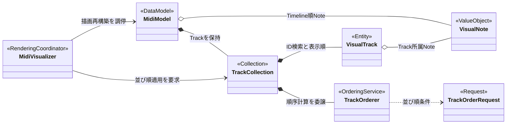

# Domain ModelとTrack管理

入力SMFから生成するData Modelと、Trackの同一性・表示順を管理するObjectの関係です。

## 責務境界

- `VisualTrack`は入力SMF上のTrack IDと、Track内Noteから算出した並べ替え用の派生値を保持します。
- `TrackOrderer`は並び順を計算しますが、`TrackCollection`を変更しません。
- `TrackCollection`はTrackの保持、ID検索、表示Index、並び順の検証と適用を所有します。
- `MidiVisualizer`は設定変更を検出し、並び順適用後の描画Object再構築を調停します。
- Track色は`VisualTrack`の属性ではなく、表示Indexから決定します。

## 正本

- MIDI Data: [`../05-midi-spec.md`](../05-midi-spec.md)
- Track並べ替え仕様: [`../03-functional-spec.md`](../03-functional-spec.md#trackの並び順)
- 設計判断: [`../08-decisions.md`](../08-decisions.md#trackの同一性と表示順を分離する)
- 実装: [`shared/tracks.ts`](../../src/shared/tracks.ts)、[`shared/track-order.ts`](../../src/shared/track-order.ts)、[`stage/visualizer.ts`](../../src/stage/visualizer.ts)
