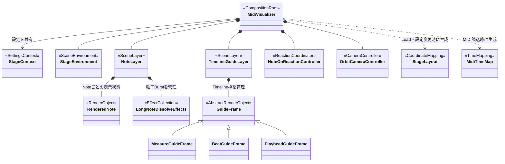
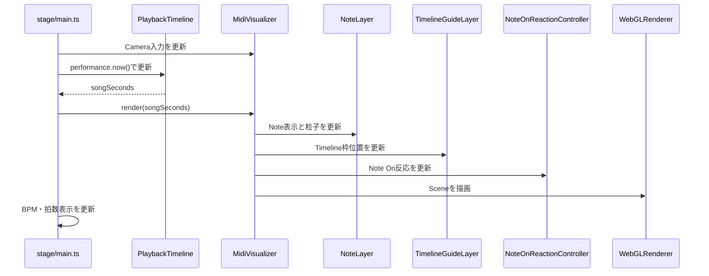

# Stage構成とフレーム更新

`MidiVisualizer`をComposition RootとしたStage描画Objectの所有関係です。

`StageContext`は各描画Objectへ注入されますが、図の交差を抑えるため個別の依存線は省略しています。

## 1フレームの主要処理

## 正本

- Module責務と毎フレーム処理: [`../07-architecture.md`](../07-architecture.md)
- 3D空間と表示仕様: [`../04-visual-spec.md`](../04-visual-spec.md)
- 実装: [`stage/visualizer.ts`](../../src/stage/visualizer.ts)、[`stage/main.ts`](../../src/stage/main.ts)、[`stage/notes`](../../src/stage/notes)、[`stage/scene`](../../src/stage/scene)
