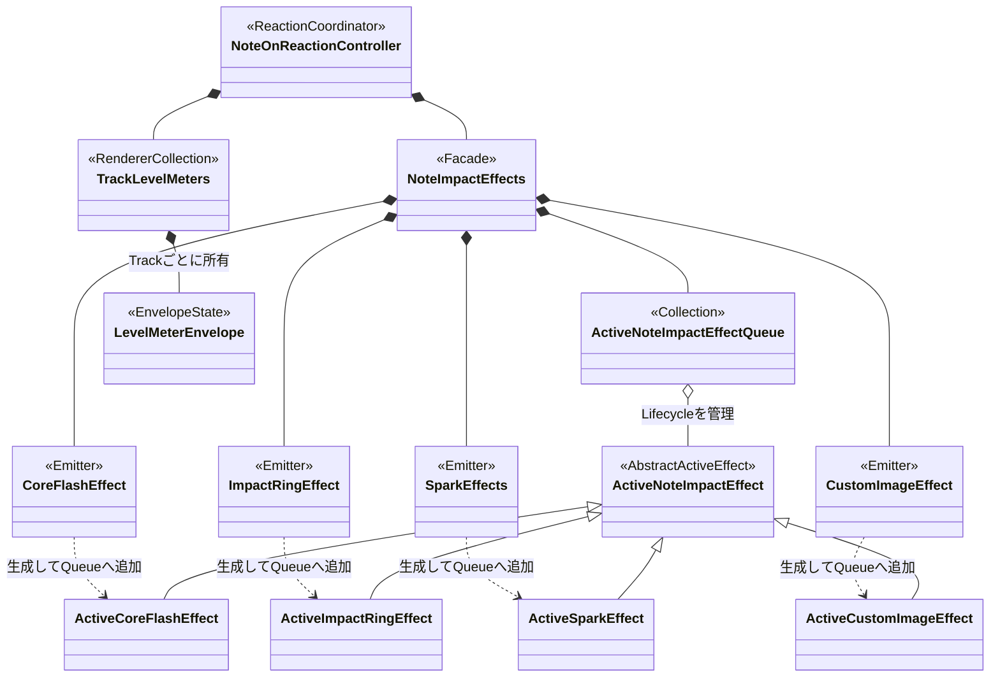
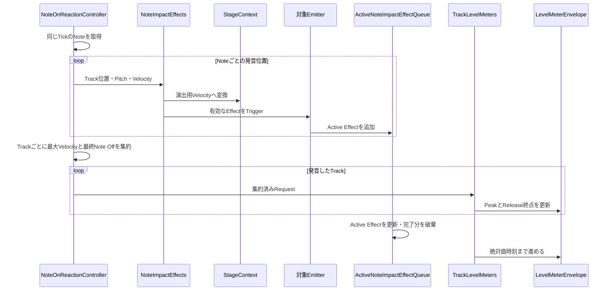

# Note OnエフェクトとLevel Meter

Note On検出後の一過性エフェクトとTrack Level Meterの主要なObject関係です。

## Note On処理

コアフラッシュは変換前のMIDI Velocityを使用し、拡散リング、スパーク、カスタム画像は`StageContext`で変換した演出用Velocityを使用します。

## 正本

- 発音エフェクトとLevel Meter仕様: [`../03-functional-spec.md`](../03-functional-spec.md#発音エフェクト)、[`../04-visual-spec.md`](../04-visual-spec.md#note-onエフェクト)
- 設計判断: [`../08-decisions.md`](../08-decisions.md#note-onエフェクトを生成処理active-objectqueueへ分離する)
- 実装: [`note-on-reaction-controller.ts`](../../src/stage/notes/note-on-reaction-controller.ts)、[`note-impact-effects.ts`](../../src/stage/effects/note-impact-effects.ts)、[`note-impact`](../../src/stage/effects/note-impact)、[`level-meters.ts`](../../src/stage/effects/level-meters.ts)
