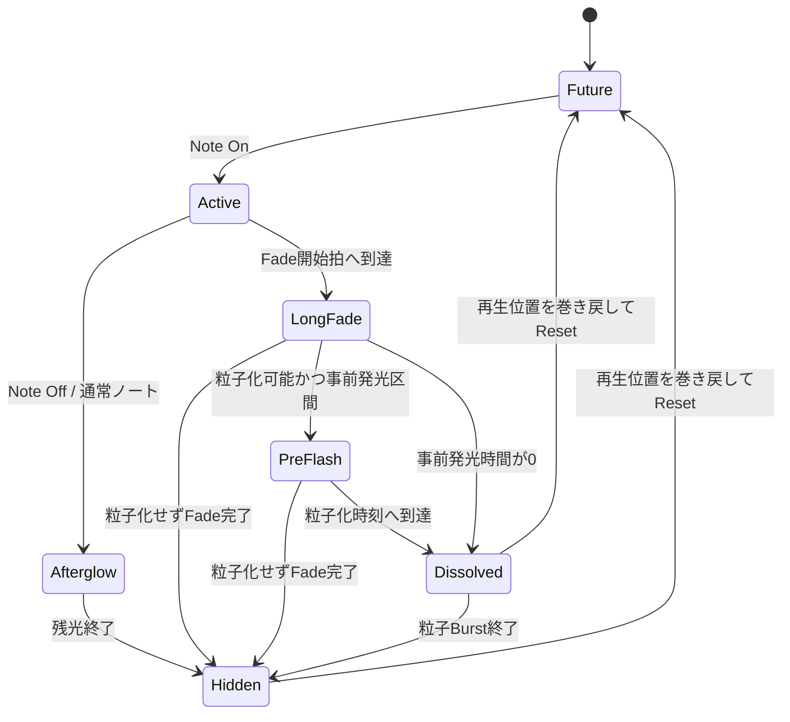
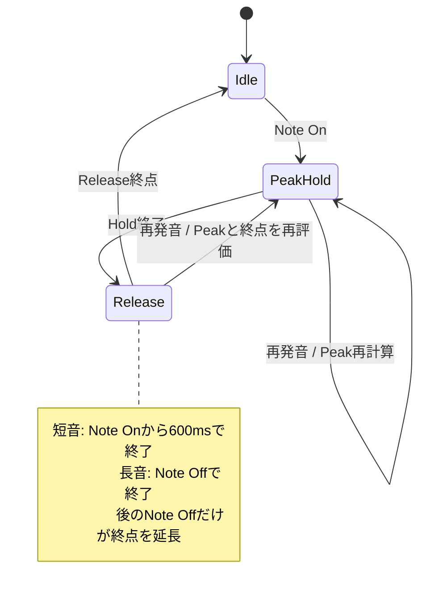

# ノートとLevel MeterのLifecycle

この文書の状態名は、複数の時刻判定から得られる表示上の概念です。Source Codeに同名の状態Enumが存在することを意味しません。

## ノート表示

- `Future`、`Active`、`Afterglow`は通常ノートの表示経路です。
- `LongFade`は設定した開始拍から実際のFade終了までの経路です。
- 粒子化に成功するとノートMeshを非表示にし、表示責務を`LongNoteDissolveEffects`の粒子Burstへ移します。
- ロングトーンFadeが適用されたノートは、完全消失後にNote Off残光へ遷移しません。

## Level Meter Envelope

EnvelopeはTrackごとに存在します。同じTickに同一Trackで複数のNote Onがある場合は、最大Velocityと最も遅いNote Offへ集約してからTriggerします。

## 正本

- ノート、ロングトーン、Level Meter仕様: [`../03-functional-spec.md`](../03-functional-spec.md)、[`../04-visual-spec.md`](../04-visual-spec.md)
- 実装: [`rendered-note.ts`](../../src/stage/notes/rendered-note.ts)、[`long-note-dissolve.ts`](../../src/stage/effects/long-note-dissolve.ts)、[`level-meter-envelope.ts`](../../src/stage/effects/level-meter-envelope.ts)
